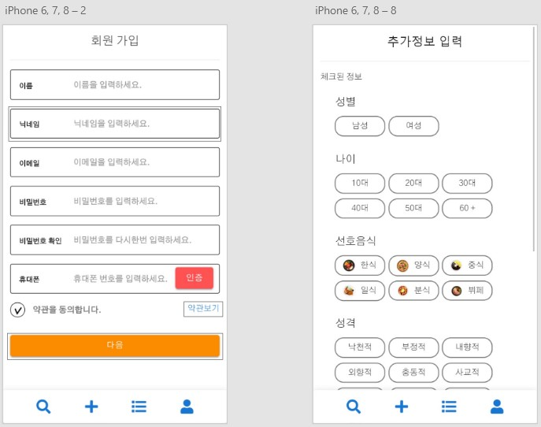
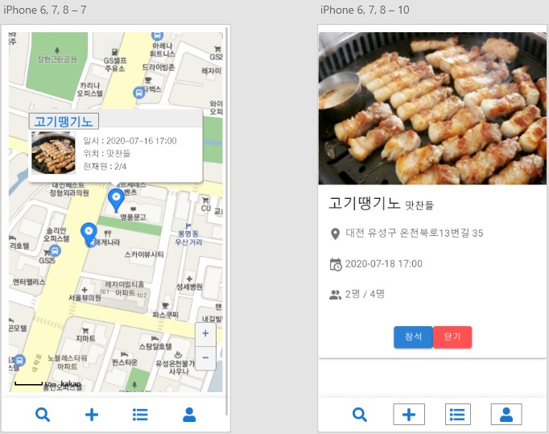
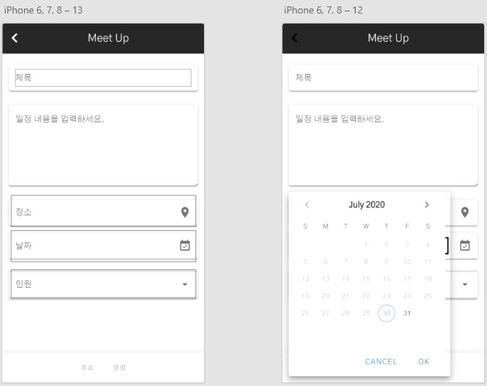
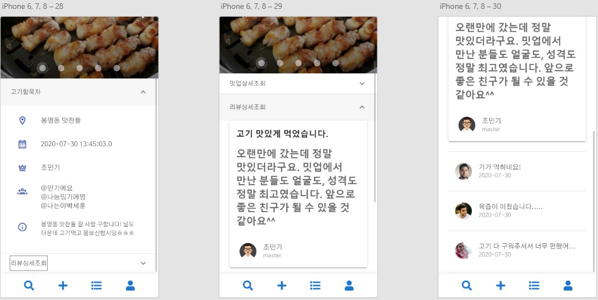
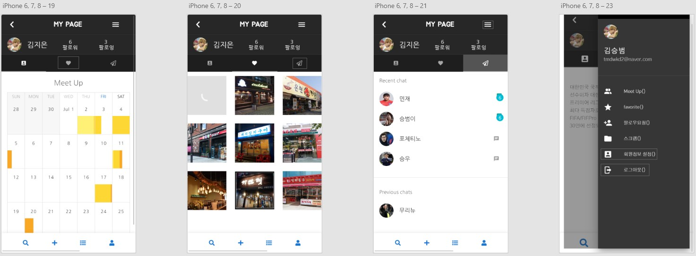

# 🍜 돈독한 미식가

> 외로운 1인 가구의 등장과 혼밥러들을 위해 식사 공동체 __MeetUp__ 서비스를 제공합니다.
> __맛집 큐레이션__을 통해 신뢰성있는 리뷰 기반의 맛집을 추천합니다.
> 여러분의 돈독한 식사를 책임지겠습니다.

## 🙋 팀원 소개

|  이름  |        역할         |                 세부사항                  |
| :----: | :-----------------: | :---------------------------------------: |
| 조민기 | 팀장 및 Tech Leader | 위치기반 서비스, MeetUp 조회 /신청 서비스 |
| 박세훈 |        개발         |           맛집 큐레이션 서비스            |
| 김승범 |         QA          |             마이페이지 서비스             |
| 김지은 |        기획         |                회원 서비스                |
| 박현영 |        기획         |            MeetUp 개설 서비스             |

## 📁 프로젝트 주요 구조

>__backend/__ 
>
>- src/main/java/com/web/curation/ : java 파일이 담겨있는 루트 폴더
>  - controller/
>    - account/ : 회원가입, 로그인, 마이페이지 등 request 처리 구현 디렉토리
>    - curation/ : 음식점 큐레이션 관련 request 처리 구현 디렉토리
>    - meetup/ : 밋업 관련 request 처리 구현 디렉토리
>    - review/ : 리뷰 관련 request 처리 구현 디렉토리
>  - dao/
>    - meetup/ : meetupController 로 부터 호출되어 DB 에 밋업과 관련된 쿼리 구현 디렉토리
>    - review/ : reviewController 로 부터 호출되어 DB 에 맛집, 리뷰와 관련된 쿼리 구현 디렉토리
>    - user/ : accountController 로 부터 호출되어 DB 에 사용자 정보와 관련된 쿼리 구현 디렉토리
>  - model/
>    - meetup/ : 밋업 관련되 객체 정의 디렉토리
>    - review/ : 맛집, 리뷰 등 관련된 객체 정의 디렉토리
>    - user/ : 사용자 정보와 관련된 객체 정의 디렉토리
>
>
>
>__frontend/__ 
>
>- src/ : 각 페이지 routing을 위한 `routers.js` 및 `App.vue` 디렉토리
>  - views/
>    - curator/ : 맛집 큐레이션 기능 구현 디렉토리
>    - feed/ : 맛집 리스트 기능 구현 디렉토리
>    - map/ : 위치기반 서비스를 위한 지도 기능 구현 디렉토리
>    - revew/ : 맛집 리뷰 기능 구현 디렉토리
>    - user/ : 로그인, 회원가입, 마이페이지 등 기능 구현 디렉토리 

## 💻 개발 개요

## 📝 앱 튜토리얼

> 회원가입 후 서비스 이용 가능하며, 로그인 후 사용자 위치 기반 지도를 보여줍니다. 지도내에 생성된 __meetup__ 내용을 확인할 수 있습니다. __meetup__ 생성을 원할시 `+` 버튼을 눌러 내용 입력하여 생성가능합니다. 또한, 맛집 리스트와 상세 리뷰 및 마이페이지 기능까지 확인할 수 있습니다.

1. 회원가입
   

   

   
2. 로그인

   

   

3. 주변 맛집 및 meetup 검색

   

   

4. meetup 추가

   

   

5. 상세 리뷰

   
   
6. 마이페이지

   
   

   

## 📡 배포 및 개발 환경

> 링크 : http://i3b302.p.ssafy.io/#/

> 개발환경
>
> - Server
>
>   
>   
>- Frontend
>   
> 
>- Backend
>   
> 
>- DB
> 
>  

