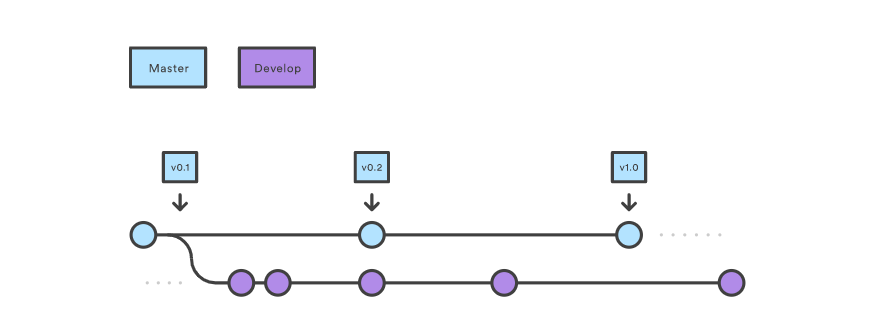
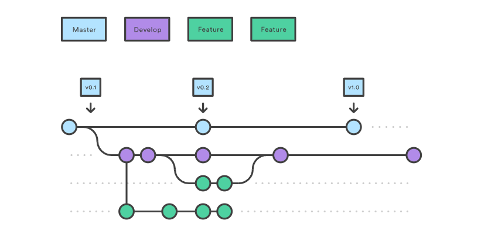
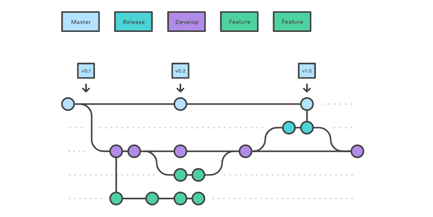

# Git Branch 정리


### 1. Master Branch

> __출시 가능한 브랜치__
>
> 배포(Release) 이력을 관리하기 위해 사용. 즉, 배포 가능한 상태만을 관리한다.




### 2. Develop Branch

> __다음 출시 버전을 개발하는 브랜치__
>
> 기능 개발을 위한 브랜치들을 병합하기 위해 사용. 즉, 모든 기능이 추가되고 버그가 수정되어 배포 가능한 안정적인 상태라면 develop 브랜치를 master 브랜치에 병합한다.
>
> 평소에는 이 브랜치를 기반으로 개발 진행한다.


### 3. Feature Branch

> __기능을 개발하는 브랜치__
>
> 새로운 기능 개발 및 버그 수정이 필요할 때마다 develop 브랜치로부터 분기한다. feature 브랜치에서의 작업은 기본적으로 공유할 필요가 없기 때문에, 로컬에서 관리한다.
>
> 개발이 완료되면 develop 브랜치로 병합하여 다른 사람들과 공유한다.

1. `develop` 브랜치에서 새로운 기능에 대한 `feature` 브랜치를 분기한다.
2. 새로운 기능에 대한 작업을 수행한다.
3. 작업이 끝나면 `develop` 브랜치로 `merge` 한다.
4. 더 이상 필요하지 않은 `feature` 브랜치는 삭제한다.
5. 새로운 기능에 대한 `feature` 브랜치를 중앙 원격 저장소에 `push` 한다.



- feature 브랜치 생성 및 종료 과정

  ```bash
  # feature 브랜치(feature/login)를 'develop' 브랜치에서 분기
  $ git checkout -b feature/login develop
  
  # feature 브랜치에서 모든 작업이 끝나면
  # 'develop' 브랜치로 이동한다.
  $ git checkout develop
  
  # 'develop' 브랜치에 feature/login 브랜치 내용을 병합(merge)한다.
  $ git merge --no-ff feature/login
  
  # -d 옵션: feature/login에 해당하는 브랜치를 삭제한다.
  $ git branch -d feature/login
  
  # 'develop' 브랜치를 원격 중앙 저장소에 올린다.
  $ git push origin develop
  ```


### 4. Release Branch

>__출시 버전을 준비하는 브랜치__
>
>배포를 위한 전용 브랜치를 사용함으로써 해당 배포를 준비하는 동안 다음 배포를 위한 기능 개발을 계속할 수 있다.
>
>이때, 다음 배포를 위한 개발 작업은 develop 브랜치에서 계속 진행한다.



- release 브랜치 생성 및 종료 과정

  ```bash
  # release 브랜치를 'develop' 브랜치에서 분기
  $ git checkout -b release-x.x develop
  
  # ~ 배포 사이클이 시작 ~
  
  # release 브랜치에서 배포 가능한 상태가 되면
  # 'master' 브랜치로 이동한다.
  $ git checkout master
  
  # 'master' 브랜치에 release-x.x 브랜치 내용을 병합(merge)한다.
  # --no-ff 옵션: 위의 추가 설명 참고
  $ git merge --no-ff release-x.x
  
  # 병합한 커밋에 Release 버전 태그를 부여한다.
  $ git tag -a x.x
  
  # 'release' 브랜치의 변경 사항을 'develop' 브랜치에도 적용
  # 'develop' 브랜치로 이동한다.
  $ git checkout develop
  
  # 'develop' 브랜치에 release-x.x 브랜치 내용을 병합(merge)한다.
  $ git merge --no-ff release-x.x
  
  # -d 옵션: release-1.2에 해당하는 브랜치를 삭제한다.
  $ git branch -d release-x.x
  ```

  

### 5. Hotfix Branch

> __출시 버전에서 발생한 버그를 수정하는 브랜치__
>
> 배포한 버전에 긴급하게 수정해야하는 경우, master 브랜치에서 분기하는 브랜치이다.

1. 배포한 버전에 긴급하게 수정을 해야 할 필요가 있을 경우,
   - master 브랜치에서 hotfix 브랜치를 분기한다.
2. 문제가 되는 부분만을 빠르게 수정한다.
   - 다시 master 브랜치에서 병합하여 이를 안정적으로 다시 배포한다.
   - 새로운 버전 이름으로 태그를 매긴다.
3. hotfix 브랜치에서의 변경 사항은 develop 브랜치에도 병합한다.


- hotfix 브랜치 생성 및 종료 과정

  ```bash
  # release 브랜치(hotfix-1.2.1)를 'master' 브랜치에서 분기
  $ git checkout -b hotfix-1.2.1 master
  
  # ~ 문제가 되는 부분만을 빠르게 수정 ~ 
  
  # 필요한 부분을 수정한 후
  # 'master' 브랜치로 이동한다.
  $ git checkout master
  
  # 'master' 브랜치에 hotfix-1.2.1 브랜치 내용을 병합(merge)한다.
  $ git merge --no-ff hotfix-1.2.1
  
  # 병합한 커밋에 새로운 버전 이름으로 태그를 부여한다.
  $ git tag -a 1.2.1
  
  # 'hotfix' 브랜치의 변경 사항을 'develop' 브랜치에도 적용
  # 'develop' 브랜치로 이동한다.
  $ git checkout develop
  
  # 'develop' 브랜치에 hotfix-1.2.1 브랜치 내용을 병합(merge)한다.
  $ git merge --no-ff hotfix-1.2.1
  ```

  